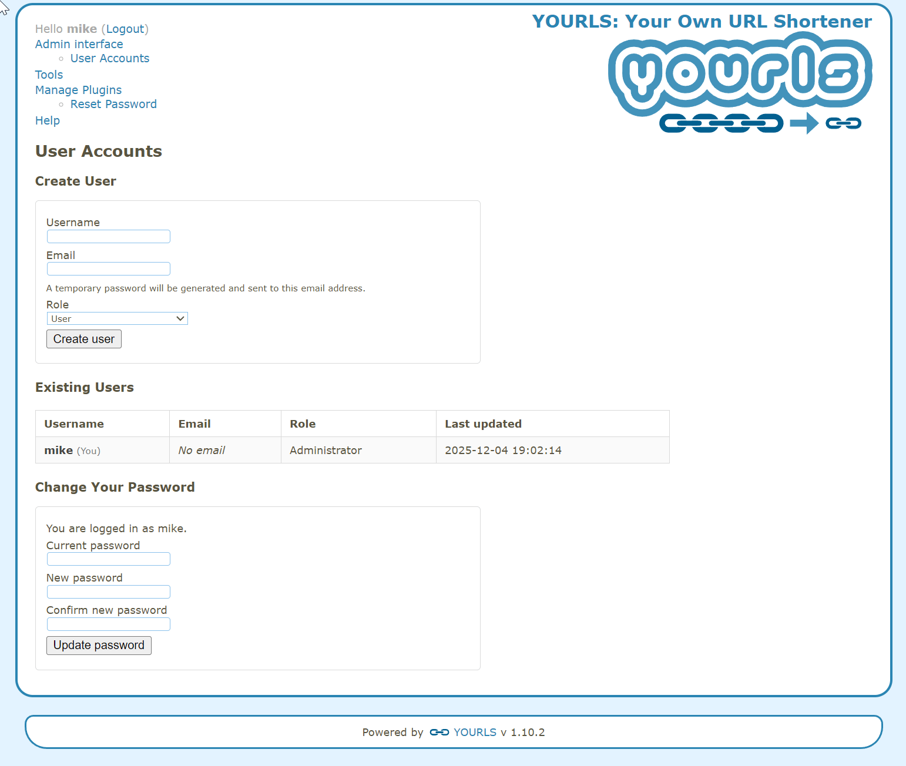

# Better User Management for YOURLS

This is an enhanced fork of [Database Users for YOURLS](https://github.com/RayHollister/database-users-for-YOURLS) that adds email support, temporary password generation, and password reset recommendations.

Better User Management replaces the static credential array in `user/config.php` with a database-backed user table and a lightweight administration panel. Activate it to keep logins inside YOURLS, grant a password self-service form, and stay compatible with existing hashing schemes.

## Enhanced Features (Added in This Fork)

- **Email Integration**: Add email addresses to user accounts for notifications
- **Temporary Password Generation**: Automatically generate secure temporary passwords for new users
- **Email Notifications**: Send temporary passwords via email using SMTP (requires PHPMailer)
- **Password Reset Recommendation**: Prominent banner on admin pages encouraging users with temporary passwords to reset them
- **Password Reset Page**: Dedicated page for users to reset their temporary passwords

## Screenshot



## Features
- Creates and maintains the `<prefix>user_credentials` table for logins, roles, email addresses, and timestamps.
- Imports the legacy `$yourls_user_passwords` array the first time the table is empty, preserving existing admins.
- Adds a Plugin page (`Admin → User Accounts`) for creating users, resetting passwords, and switching between the built-in `admin` and `user` roles.
- **Email support**: Store and manage email addresses for all users.
- **Automatic temporary passwords**: New users receive a secure temporary password that is emailed to them.
- **Password reset recommendation**: Users with temporary passwords see a prominent banner on all admin pages encouraging them to reset their password.
- Provides a self-service password change form for the currently logged-in account.
- Normalizes hashes to YOURLS-style `phpass:` values while still accepting `md5:` and plain strings.
- Populates the `YOURLS_USER_ROLE` constant at login so the rest of your install can respect roles.
- Persists migration flags and a serialized credential cache in YOURLS options to avoid repeated SQL during redirect traffic. (Thanks to [@ozh](https://github.com/ozh) for catching this!)

## Requirements
- YOURLS 1.8 or newer (other versions are untested).
- Database user able to run `CREATE TABLE` on the YOURLS database.
- Access to manage YOURLS plugins in the admin dashboard.
- **PHPMailer** (for email functionality): Install via Composer (`composer require phpmailer/phpmailer`) or manually place in the plugin directory.
- **SMTP Configuration**: Add the following SMTP settings to your YOURLS `user/config.php` file to enable email functionality:
  ```php
  define('YOURLS_SMTP_HOST', 'smtp.example.com');
  define('YOURLS_SMTP_USER', 'your_smtp_username');
  define('YOURLS_SMTP_PASS', 'your_smtp_password');
  define('YOURLS_SMTP_PORT', 587); // or 465 for SSL
  
  // Optional: Customize email sender information
  define('YOURLS_SMTP_FROM', 'noreply@yourdomain.com'); // Optional, defaults to SMTP_USER
  define('YOURLS_SMTP_FROM_NAME', 'Your Site Name'); // Optional, defaults to "YOURLS Admin"
  ```

## Installation
1. Copy or clone this folder to `user/plugins/db-users`.
2. Sign in to the YOURLS admin area and activate **Database Users** on the Plugins page.
3. On activation the plugin creates the credential table and, if it is empty, migrates every entry from `$yourls_user_passwords` in `user/config.php`.

## Usage
- Open `Admin → User Accounts` to manage credentials.
- **Create users**: fill in username, email address, and role. A temporary password will be automatically generated and emailed to the user.
- **Update users**: expand a user row to change email, role, or set a new password. The plugin guards against removing the final administrator.
- **First login**: Users with temporary passwords will see a prominent banner on admin pages recommending they reset their password. They can access the password reset page from the banner or via the menu.
- **Self-service**: the bottom form lets the signed-in user change their own password after validating the current one. Successful changes refresh the session cookie.

## Programmatic helpers
- `db_users_add_user( $username, $password, $role = 'user' )` inserts a user with normalized password storage.
- `db_users_verify_password( $username, $password )` checks credentials against the cached values, reloading if necessary.
- `db_users_refresh_credentials_cache()` repopulates the global `$yourls_user_passwords` array from the database.

Call `db_users_refresh_credentials_cache()` after programmatic inserts or updates so new credentials are instantly available to YOURLS.

## Data model
Records live in `<prefix>user_credentials` with columns for `user_login`, `user_pass`, `user_role`, `email`, `needs_password_reset`, `created_at`, and `updated_at`. Passwords are stored as YOURLS-compatible `phpass:` hashes unless an `md5:` hash is supplied. The `needs_password_reset` flag is set to 1 for new users and cleared after they reset their password. Timestamps are updated automatically on create and update actions.

## Troubleshooting
- Enable `YOURLS_DEBUG` to capture log entries written with `yourls_debug_log()` when insert or update operations fail.
- If logins appear stale, trigger `db_users_refresh_credentials_cache()` or revisit the admin page to rebuild the cache.
- Ensure the database account can create tables the first time the plugin activates; otherwise, manually run the schema from `plugin.php`.

## Credits

**This Fork**: Enhanced by [Gas Mark 8, Ltd.](https://gasmark8.com)

**Original Plugin**: Built and maintained by [Ray Hollister](https://rayhollister.com). This is a fork of [database-users-for-YOURLS](https://github.com/RayHollister/database-users-for-YOURLS) with additional email and security features.
